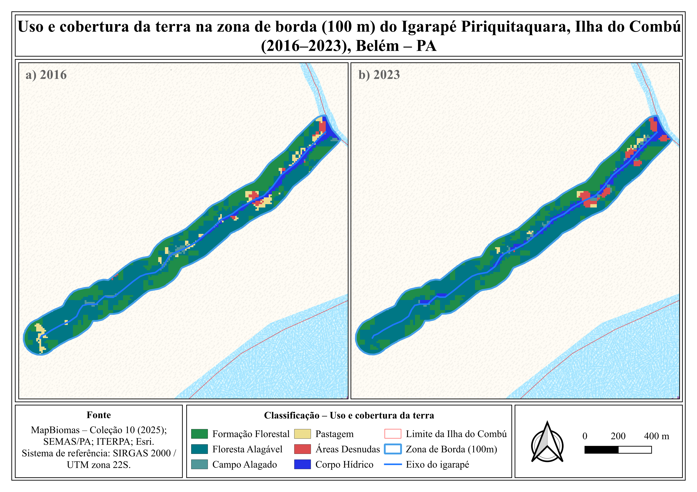
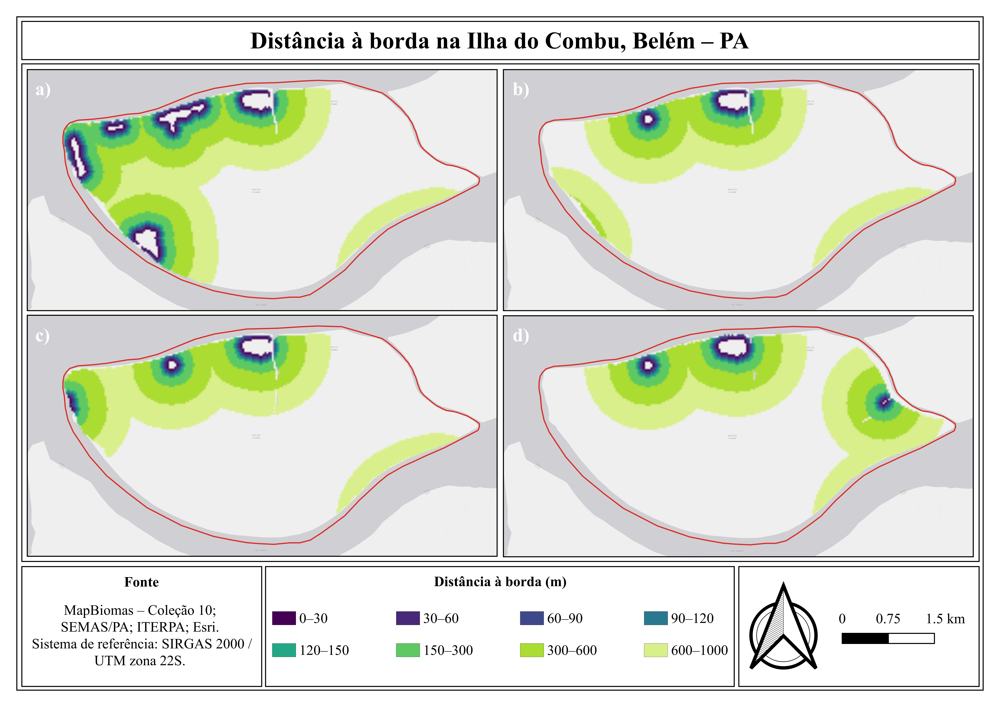
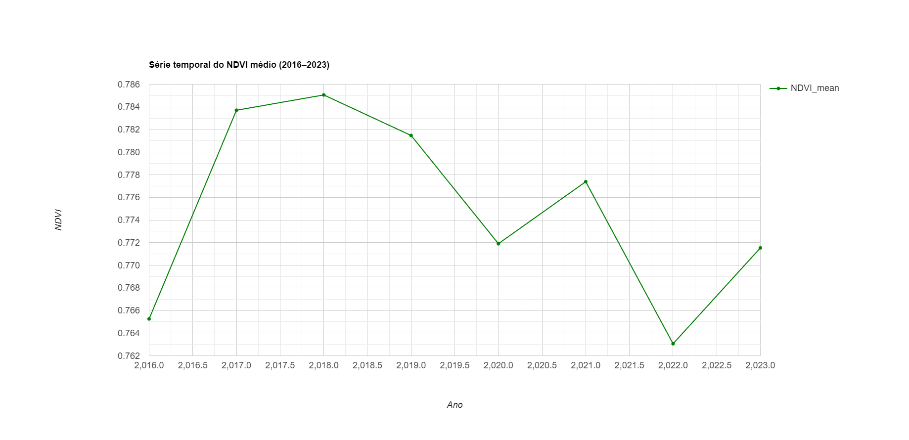
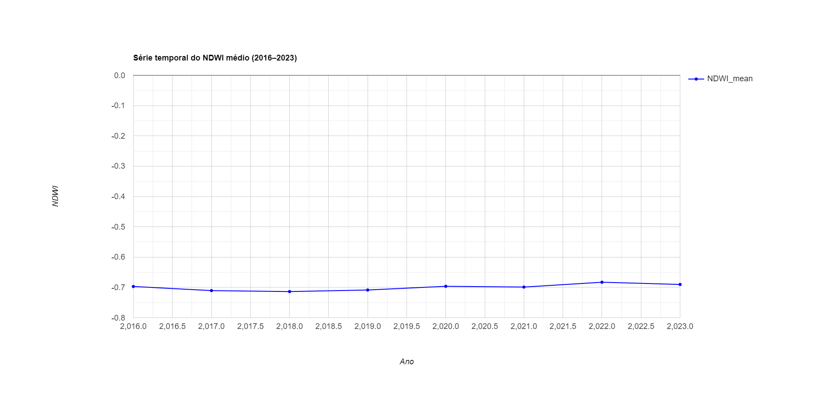
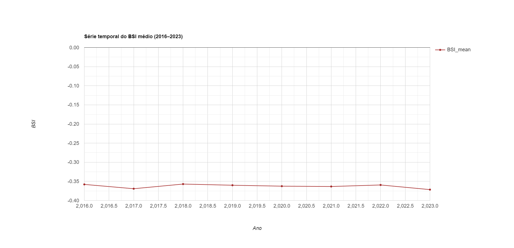
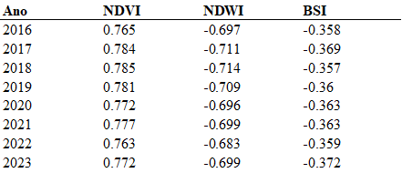
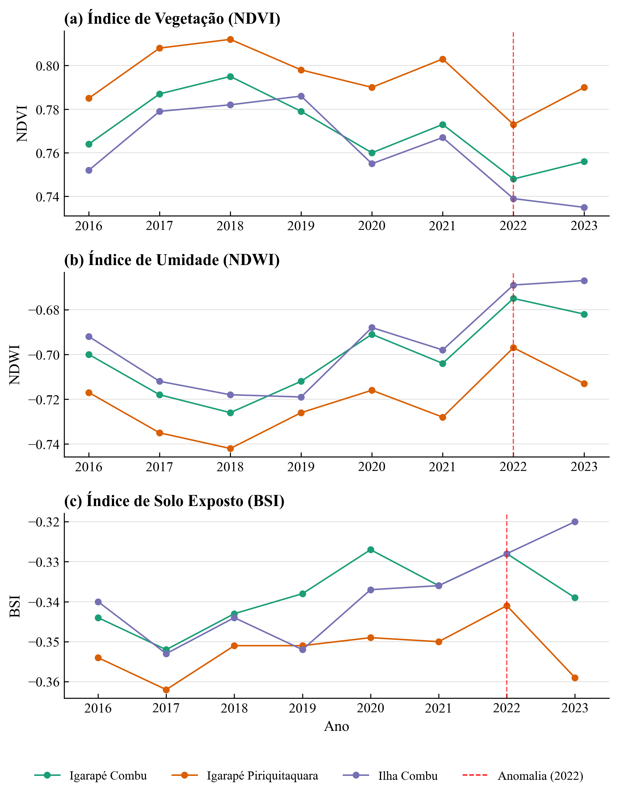

# 🌍 Remote Sensing and Land Use Analysis – Combu Island (PA)

This project presents a geospatial analysis of land use and land cover, spectral indices, and edge dynamics in Combu Island, Pará, Brazilian Amazon.

## 📌 Objectives
- Analyze land use and land cover patterns  
- Evaluate vegetation and water dynamics using spectral indices  
- Assess edge effects and environmental vulnerability  
- Support environmental monitoring and territorial management  

---

## 🛠️ Tools & Technologies
- QGIS  
- Google Earth Engine (GEE)  
- R  
- Python  
- MapBiomas  

---

## 📍 Study Area
Combu Island, located in the municipality of Belém, Pará, in the Eastern Amazon region.

---

## ⚙️ Methodology
The analysis was performed using remote sensing and GIS techniques:

- Extraction of spectral indices (NDVI, NDWI, BSI) from satellite imagery  
- Temporal analysis of environmental indicators (2016–2023)  
- Land use and land cover classification (MapBiomas)  
- Edge-distance analysis to evaluate environmental vulnerability  
- Integration of spatial and statistical analysis  

---

## 🗺️ Maps

### 🌱 Land Use and Land Cover – Combu Island

### 🌊 Land Use – Igarapé Combu

### 🌊 Land Use – Igarapé Piriquitaguara

### 📏 Edge Distance Analysis

---

## 📊 Results

### 📈 Spectral Indices (NDVI, NDWI, BSI)

### 📋 Summary Table

### 📊 Integrated Analysis

---

## 📊 Interpretation

- Higher NDVI values indicate areas with denser and healthier vegetation  
- NDWI highlights water presence and hydrological dynamics  
- BSI helps identify exposed soil and degraded areas  
- Edge-distance analysis reveals areas more vulnerable to environmental pressure  

---

## 📂 Repository Structure
- `maps/` → final maps  
- `results/` → graphs, tables, and analysis outputs  
- `scripts/` → processing and visualization scripts  
- `data/` → description of data sources  

---

## 👨‍💻 Author
Paulo Esquerdo  
GIS Analyst | Environmental Monitoring
